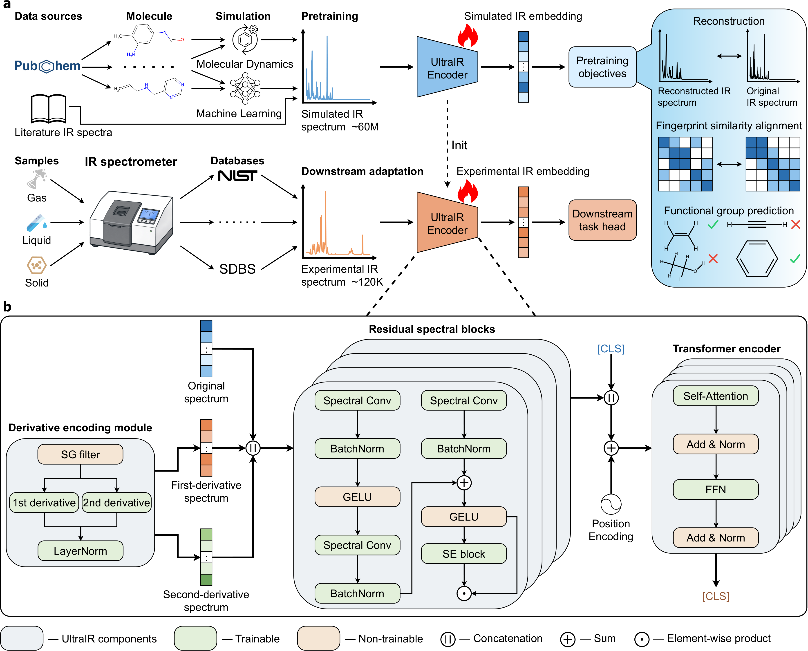

# UltraIR

Official implementation of **UltraIR**, the foundation model introduced
in **[Simulation-to-real transfer learning for infrared spectroscopic chemical
sensing and analysis from molecules to complex samples](https://arxiv.org/abs/2608.13341)**.

<p align="center">
<a href="https://arxiv.org/abs/2608.13341"></a>
<a href="https://huggingface.co/yusentan/UltraIR"></a>
<a href="data/README.md"></a>
</p>

This repository provides the model implementations, pretraining pipeline,
downstream training and evaluation runner, task configurations, data
preparation utilities, and runnable NumPy examples.

## Model overview

UltraIR contains more than 100 million parameters and learns a transferable
spectral representation from approximately 60 million simulated IR spectra.
The pretrained encoder can then be adapted to molecular interpretation,
mixture analysis, and biological, botanical, and environmental sensing tasks.

[](assets/figures/ultrair_overview.pdf)

*Figure 1. Overview of the UltraIR simulation-to-real learning framework and
encoder architecture. [View the full-resolution PDF.](assets/figures/ultrair_overview.pdf)*

UltraIR follows a two-stage simulation-to-real learning strategy:

1. **Pretraining.** A shared encoder is trained on simulated spectra through
   the UltraIR pretraining pipeline.
2. **Downstream adaptation.** The pretrained encoder and a task-specific head
   are jointly optimized on labeled data for the selected analytical task.

The encoder combines a derivative-aware multi-channel input, hierarchical
convolutional feature extraction and fusion, and a patch-based Transformer.
Dedicated adapters extend the shared encoder to formula-conditioned molecular
structure generation and reference-guided pairwise mixture analysis.

## Table of contents

- [Model overview](#model-overview)
- [Supported tasks](#supported-tasks)
- [Repository layout](#repository-layout)
- [Installation](#installation)
- [Checkpoints and data](#checkpoints-and-data)
- [Quick start with demo data](#quick-start-with-demo-data)
- [Downstream training and evaluation](#downstream-training-and-evaluation)
- [Checkpoint evaluation](#checkpoint-evaluation)
- [Pretraining](#pretraining)
- [Outputs](#outputs)
- [Unlabeled prediction](#unlabeled-prediction)
- [Acknowledgements](#acknowledgements)
- [Citation](#citation)

## Supported tasks

| Area | Task | Model input and output | Configs | Reported metrics |
| --- | --- | --- | --- | --- |
| Molecular interpretation | Functional-group prediction | IR spectrum to 17 multi-label functional groups | `nist`, `sdbs`, `uspto` | Micro-F1, Macro-F1, exact match ratio |
| Molecular interpretation | Molecular structure elucidation | IR spectrum and molecular formula to ranked SMILES candidates | `nist`, `sdbs`, `uspto` | Top-1/5/10 accuracy, validity, Tanimoto similarity, scaffold match |
| Molecular interpretation | Physicochemical property prediction | IR spectrum to 11 molecular properties | `nist`, `sdbs`, `uspto` | Normalized MAE, normalized RMSE, R2 |
| Mixture analysis | Targeted component detection | Reference and mixture spectra to presence probability | `nist`, `sdbs`, `uspto` | Accuracy, Macro-F1, ROC-AUC, average precision |
| Mixture analysis | Targeted fractional contribution estimation | Reference and mixture spectra to component fraction | `nist`, `sdbs`, `uspto` | MAE, RMSE, R2 |
| Mixture analysis | Mixture-level component quantification | Mixture spectrum to four component quantities | `experimental_four_component`, `synthetic_four_component` | Normalized MAE, normalized RMSE, R2 |
| Biological sensing | Bacterial classification | FTIR spectrum to one of nine genera | `bacterial_classification` | Accuracy, Macro-F1, MCC |
| Botanical sensing | Medicinal-herb geographic origin traceability | FTIR spectrum to geographic origin | `jyh`, `syh` | Accuracy, Macro-F1, MCC |
| Botanical sensing | Medicinal-herb constituent quantification | FTIR spectrum to constituent abundances | `jyh_lc`, `syh_lc` | Normalized MAE, normalized RMSE, R2 |
| Environmental sensing | Microplastics classification | IR spectrum to one of 18 polymer classes | `microplastics_classification` | Accuracy, Macro-F1, MCC |
| Environmental sensing | Soil property prediction | Mid-IR spectrum to ten soil properties | `soil_property_prediction` | Normalized MAE, normalized RMSE, R2 |

All experiment YAML files are under [`configs/`](configs/). Tasks with several
datasets require an explicit `--config`; a task with exactly one YAML can also
be selected by its full name or initialism through `--task`.

## Repository layout

```text
UltraIR/
  assets/figures/          # framework figure used in this README
  configs/                 # pretraining and downstream experiment YAML files
  data/
    common/                # shared download, conversion, and split utilities
    pretraining/           # pretraining data documentation and NumPy demo
    <task>/                # task data documentation, tools, and fold-demo arrays
  scripts/
    pretrain.py            # pretraining pipeline
    run.py                 # downstream training and evaluation
    evaluate.py            # checkpoint-evaluation wrapper
    predict.py             # unlabeled single-spectrum or batch prediction
    prepare_data.py        # YAML-recipe preparation/validation entry point
  src/ultrair/
    datasets/              # NumPy datasets, fold loading, preprocessing
    models/                # encoder, task heads, and adapters
    pretraining/           # pretraining datasets, losses, heads, and trainer
    tasks/                 # task contracts, losses, decoding, and metrics
    utils/                 # transforms, checkpoint helpers, and tokenizer
    engine.py              # training and validation loop
    infer.py               # evaluation and prediction export
  requirements.txt         # Python dependency list
  setup.py                 # package metadata and editable-install entry point
```

## Installation

Python 3.10 or newer is required. Install a PyTorch build compatible with the
local CUDA driver first when GPU acceleration is needed, then install UltraIR
from the repository root:

```bash
conda create -n ultrair python=3.10 -y
conda activate ultrair

# Install the appropriate PyTorch build for your system first if necessary.
pip install -e .
```

The core dependencies are PyTorch, NumPy, PyYAML, `pytorch-wavelets`,
PyWavelets, RDKit, and tqdm. Some source converters have optional dependencies:

```bash
pip install pandas pillow pyarrow scipy opencv-python pytesseract
```

- `pillow` is used for SDBS plot digitization.
- `pyarrow` is used for USPTO Parquet conversion.
- `pandas` reads the FTIRMix source tables, and `scipy` constructs its
  synthetic samples.
- `opencv-python` provides the legacy cubic spectral resize path; a PyTorch
  fallback is available when it is absent.
- `pytesseract` and a local Tesseract executable enable optional SDBS phase
  detection.

The molecular-dynamics generator has a separate OpenMM/OpenFF environment; see
[`data/pretraining/molecular_dynamics/README.md`](data/pretraining/molecular_dynamics/README.md).

Verify the installation with:

```bash
python -m scripts.run --help
python -m scripts.evaluate --help
python -m scripts.predict --help
python -m scripts.pretrain --help
```

## Checkpoints and data

Pretrained and task-adapted weights are distributed separately through the
[UltraIR Hugging Face repository](https://huggingface.co/yusentan/UltraIR).
Use a checkpoint that matches the selected task, dataset, and model
configuration. A path supplied with `--ckpt` overrides `run.init_ckpt` from the
YAML file.

Install the Hugging Face CLI, then run downloads from the UltraIR repository
root so that `--local-dir .` recreates the `checkpoints/...` paths referenced by
the YAML files and commands below:

```bash
python -m pip install -U huggingface_hub
```

Download only the six encoder-pretraining checkpoints (approximately 3.2 GB):

```bash
hf download yusentan/UltraIR \
  --include "checkpoints/pretraining/*.pt" \
  --local-dir .
```

This set contains the five general pretraining epochs and the
molecular-structure pretraining checkpoint. To also obtain every released
task-adapted checkpoint, download the complete checkpoint tree instead (19
files, approximately 11.1 GB):

```bash
hf download yusentan/UltraIR \
  --include "checkpoints/**" \
  --local-dir .
```

The second command includes the pretraining files, so the two commands are
alternatives rather than consecutive steps. Both preserve the remote directory
layout under the local `checkpoints/` directory.

Task directories provide a runnable `fold-demo` with the same file contract as
prepared data. The two medicinal-herb task directories contain complete
packaged train/validation/test arrays. Start with
[`data/README.md`](data/README.md) for source links and shared conventions, then
use the task-specific document for exact filenames, shapes, label order,
normalization, and preparation commands:

| Task | Data documentation |
| --- | --- |
| Functional-group prediction | [`data/functional_group_prediction/README.md`](data/functional_group_prediction/README.md) |
| Molecular structure elucidation | [`data/molecular_structure_elucidation/README.md`](data/molecular_structure_elucidation/README.md) |
| Physicochemical property prediction | [`data/physicochemical_property_prediction/README.md`](data/physicochemical_property_prediction/README.md) |
| Targeted component detection | [`data/targeted_component_detection/README.md`](data/targeted_component_detection/README.md) |
| Targeted fractional contribution estimation | [`data/targeted_fractional_contribution_estimation/README.md`](data/targeted_fractional_contribution_estimation/README.md) |
| Mixture-level component quantification | [`data/mixture_level_component_quantification/README.md`](data/mixture_level_component_quantification/README.md) |
| Bacterial classification | [`data/bacterial_classification/README.md`](data/bacterial_classification/README.md) |
| Medicinal-herb geographic origin | [`data/medicinal_herb_geographic_origin_traceability/README.md`](data/medicinal_herb_geographic_origin_traceability/README.md) |
| Medicinal-herb constituent quantification | [`data/medicinal_herb_constituent_quantification/README.md`](data/medicinal_herb_constituent_quantification/README.md) |
| Microplastics classification | [`data/microplastics_classification/README.md`](data/microplastics_classification/README.md) |
| Soil property prediction | [`data/soil_property_prediction/README.md`](data/soil_property_prediction/README.md) |
| Pretraining | [`data/pretraining/README.md`](data/pretraining/README.md) |

## Quick start with demo data

Use the packaged NIST functional-group `fold-demo` to try the training and
evaluation workflow. This is a small example dataset; download the pretraining
checkpoints above before starting.

First, train for one epoch on the demo split:

```bash
python -m scripts.run \
  --config configs/functional_group_prediction/nist.yaml \
  --fold demo \
  --epochs 1 \
  --num-workers 0 \
  --drop-last false \
  --device cpu \
  --ckpt checkpoints/pretraining/ultrair_pretraining_general_epoch5.pt
```

`--drop-last false` keeps the demo's 70-sample training batch. The runner saves
`best` and `last` checkpoints and evaluates the configured checkpoint at the
end of training. Re-run evaluation on the latest `best` checkpoint with:

```bash
python -m scripts.evaluate \
  --config configs/functional_group_prediction/nist.yaml \
  --fold demo \
  --ckpt-tag best \
  --device cpu \
  --report-only
```

`--report-only` prints metrics without writing another result file. For
full-data workflows, continue with
[Downstream training and evaluation](#downstream-training-and-evaluation),
[Unlabeled prediction](#unlabeled-prediction), and
[Checkpoint evaluation](#checkpoint-evaluation), together with the selected
task's data documentation.

## Downstream training and evaluation

The downstream runner reads model, task, optimizer, augmentation, data, and
output settings from one YAML. The released downstream configs use
`train_eval` mode: each command trains the selected fold, saves its checkpoints,
and evaluates the checkpoint selected by `run.ckpt_tag`. The separate
[Checkpoint evaluation](#checkpoint-evaluation) workflow evaluates an existing
checkpoint without training.

For a task with one configuration, select it by its full name or initialism.
For example, initialize from a downloaded pretrained encoder, train on the
packaged bacterial-classification data, and evaluate the resulting model:

```bash
python -m scripts.run \
  --task bacterial_classification \
  --fold demo \
  --ckpt checkpoints/pretraining/ultrair_pretraining_general_epoch5.pt \
  --device cuda:0
```

Tasks with multiple dataset configurations require the exact YAML path. The
following table covers every downstream task; the short identifier is accepted
where a `--task` selector is shown.

| Task identifier | Short | CLI selector |
| --- | --- | --- |
| `bacterial_classification` | `bc` | `--task bacterial_classification` or `--task bc` |
| `functional_group_prediction` | `fgp` | `--config configs/functional_group_prediction/nist.yaml` (also `sdbs`, `uspto`) |
| `medicinal_herb_constituent_quantification` | `mhcq` | `--config configs/medicinal_herb_constituent_quantification/jyh_lc.yaml` (also `syh_lc`) |
| `medicinal_herb_geographic_origin_traceability` | `mhgot` | `--config configs/medicinal_herb_geographic_origin_traceability/jyh.yaml` (also `syh`) |
| `microplastics_classification` | `mc` | `--task microplastics_classification` or `--task mc` |
| `mixture_level_component_quantification` | `mlcq` | `--config configs/mixture_level_component_quantification/experimental_four_component.yaml` (also `synthetic_four_component`) |
| `molecular_structure_elucidation` | `mse` | `--config configs/molecular_structure_elucidation/nist.yaml` (also `sdbs`, `uspto`) |
| `physicochemical_property_prediction` | `ppp` | `--config configs/physicochemical_property_prediction/nist.yaml` (also `sdbs`, `uspto`) |
| `soil_property_prediction` | `spp` | `--task soil_property_prediction` or `--task spp` |
| `targeted_component_detection` | `tcd` | `--config configs/targeted_component_detection/nist.yaml` (also `sdbs`, `uspto`) |
| `targeted_fractional_contribution_estimation` | `tfce` | `--config configs/targeted_fractional_contribution_estimation/nist.yaml` (also `sdbs`, `uspto`) |

When `--ckpt` is omitted in `train_eval` mode, the runner uses the YAML's
`run.init_ckpt`. Encoder-only weights are automatically mapped under the
downstream model's encoder. Add `--strict` only when the supplied checkpoint is
expected to contain the exact complete downstream state dictionary.

For prepared data outside the repository, override the data root without
editing the YAML:

```bash
python -m scripts.run \
  --config configs/physicochemical_property_prediction/nist.yaml \
  --data-root /path/to/prepared/physicochemical_property_prediction/nist \
  --fold 1 \
  --ckpt checkpoints/pretraining/ultrair_pretraining_general_epoch5.pt
```

Common command-line overrides include:

```text
--mode {train_eval,infer_eval}
--device {cpu,cuda,cuda:N}
--data-root PATH
--data-layout {flat,fold_directories}
--epochs N
--num-workers N
--drop-last BOOL
--aug PATH
--save-every N
--ckpt-tag {best,last}
--report-only
```

After preparing five folds, replace `--fold N` with `--kfold`. A partial run
can continue at a later fold with `--kfold --start-fold N`.

## Checkpoint evaluation

`scripts.evaluate` invokes the canonical runner in `infer_eval` mode. Supply a
checkpoint directly for one fold:

```bash
python -m scripts.evaluate \
  --task microplastics_classification \
  --fold demo \
  --ckpt checkpoints/microplastics_classification/ultrair.pt \
  --device cuda:0 \
  --strict
```

For cross-validation, omit `--ckpt`; the runner resolves each fold's latest
`best` or `last` checkpoint from its configured output directory:

```bash
python -m scripts.evaluate \
  --config configs/targeted_component_detection/nist.yaml \
  --kfold \
  --ckpt-tag best \
  --device cuda:0
```

## Pretraining

The pretraining loader expects these three row-aligned files. The packaged demo
has 256 examples and uses the same file contract as a full pretraining
collection:

```text
ir_norm.npy            # [N, L]
fingerprint.npy         # [N, 2048]
functional_groups.npy  # [N, 17]
```

```bash
python -m scripts.pretrain \
  --config configs/pretraining/default.yaml \
  --data-root data/pretraining/demo \
  --output-dir /path/to/pretraining_output \
  --epochs 1 \
  --num-workers 0 \
  --device cuda:0
```

For a prepared collection, replace `data/pretraining/demo` with the directory
containing the same three files. Resume model, optimizer, and scheduler state
with `--resume /path/to/checkpoint.pt`. Pretraining outputs include `best.pt`,
`last.pt`, `history.json`, and encoder-only epoch checkpoints for downstream
initialization.

See [`data/pretraining/README.md`](data/pretraining/README.md) for the public
sources, aligned-array preparation, generated-data utilities, and full input
contract.

## Outputs

Downstream training uses fold-isolated checkpoint paths. Depending on the
selected YAML, the directory contains one or both checkpoint tags:

```text
checkpoints/<task>/<method>/fold-<N>/
  best_<run-id>.pt
  last_<run-id>.pt
```

Medicinal-herb runs add a `jyh/` or `syh/` dataset directory beneath the task
directory. When result saving is enabled by the YAML, evaluation files use:

```text
results/<task>/<method>/fold-<N>/
  test_<tag>.txt
  test_<tag>.json
  test_<tag>_predictions.npz
  test_<tag>_sample_predictions.csv
```

With JSON result saving enabled, a multi-fold evaluation also writes
`results/<task>/<method>/test_<tag>_kfold_summary.json`, containing the mean,
population standard deviation, and fold count for every numeric metric.

## Unlabeled prediction

`scripts.predict` accepts unlabeled spectra from any NPY path. A single spectrum
can have shape `[L]`; batches can have shape `[N, L]` or `[N, 1, L]`. The
selected YAML applies the same spectral preprocessing and resize operation used
during training. Input values, units, and wavenumber ordering must follow the
selected task's data contract; resizing changes only the point count.

For example, predict the geographic origin of one spectrum or a batch:

```bash
python -m scripts.predict \
  --config configs/medicinal_herb_geographic_origin_traceability/jyh.yaml \
  --ckpt checkpoints/medicinal_herb_geographic_origin_traceability/jyh/ultrair_jyh.pt \
  --input /path/to/unlabeled_jyh_spectra.npy \
  --output predictions.json \
  --device cuda:0
```

The two targeted mixture tasks accept one pair as `[2, L]` or a batch as
`[N, 2, L]`. Channel 0 is the pure reference spectrum and channel 1 is the
mixture spectrum:

```bash
python -m scripts.predict \
  --config configs/targeted_component_detection/nist.yaml \
  --ckpt checkpoints/targeted_component_detection/ultrair_nist.pt \
  --input /path/to/reference_mixture_pairs.npy \
  --output detection_predictions.json
```

Molecular structure elucidation also needs a formula. Use `--formula-text` for
one formula shared by all input rows, or `--formula formula.npy` for a scalar or
row-aligned `[N]` array:

```bash
python -m scripts.predict \
  --config configs/molecular_structure_elucidation/nist.yaml \
  --ckpt checkpoints/molecular_structure_elucidation/ultrair_nist.pt \
  --input /path/to/unlabeled_spectrum.npy \
  --formula-text C5H12O \
  --output structure_predictions.json
```

Classification output includes class probabilities, functional-group output
includes all 17 probabilities and selected labels, regression output is
converted back to the original target scale, and structure output contains
ranked SMILES candidates. Unlabeled functional-group prediction and targeted
detection use a fixed threshold of 0.5 by default; `--threshold` overrides it.
Use `--beam-size` and `--num-candidates` to control structure generation. When
`--output` is omitted, the JSON is printed to standard output.

Some configurations use preprocessing or target-normalization statistics from
the checkpoint's training fold. For medicinal-herb tasks this includes
point-wise spectral standardization; regression configurations use target
statistics; mixture-level quantification also standardizes spectra.
`scripts.predict` reads the reference arrays from
`--stats-fold`, which defaults to the YAML's `data.default_fold` (`demo` in the
released configs). Set it to the fold used to train the supplied checkpoint,
and use `--data-root` when those reference arrays are outside the repository.

## Acknowledgements

We thank our collaborators for valuable discussions on infrared spectroscopy,
chemical sensing, and experimental validation. We gratefully acknowledge
funding and institutional support from The Hong Kong University of Science and
Technology (Guangzhou) (HKUST(GZ)). We also thank the State Key Laboratory of
Chemo and Biosensing at the College of Chemistry and Chemical Engineering,
Hunan University, for providing the experimental IR data supporting the
medicinal-herb geographic-origin traceability and constituent quantification
tasks.

## Citation

If you find UltraIR useful in your research, please cite our paper:

**Paper:** [Simulation-to-real transfer learning for infrared spectroscopic
chemical sensing and analysis from molecules to complex samples](https://arxiv.org/abs/2608.13341)

```bibtex
@misc{tan2026simulation,
  title         = {Simulation-to-real transfer learning for infrared spectroscopic
                   chemical sensing and analysis from molecules to complex samples},
  author        = {Yusen Tan and Yixuan Chen and Zheng Fang and Pan Liu and
                   Yifan Li and Qinyu Guo and Zhedong Lin and Yuqiang Li and
                   Xiangxiang Zeng and Tong Wang and Jun Xia},
  year          = {2026},
  eprint        = {2608.13341},
  archivePrefix = {arXiv},
  primaryClass  = {cs.LG},
  url           = {https://arxiv.org/abs/2608.13341}
}
```
