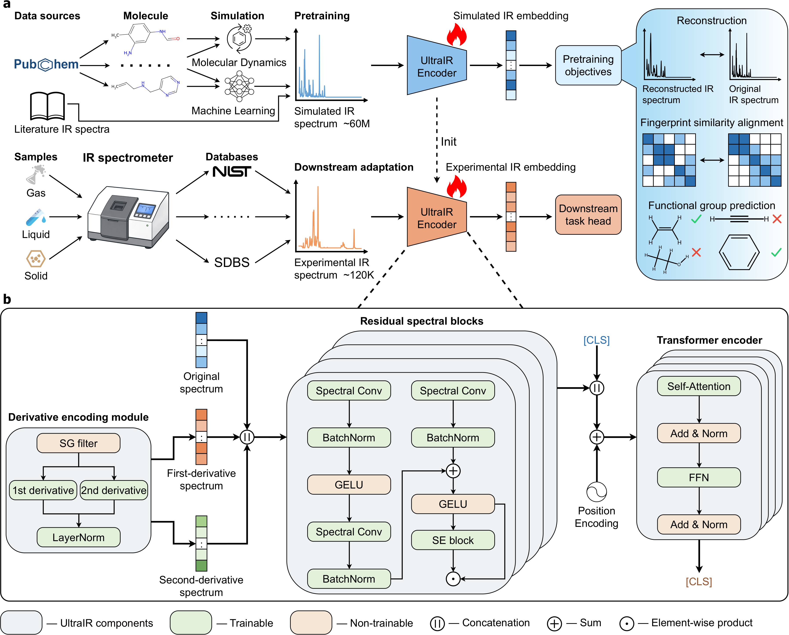

# UltraIR

Official implementation of **UltraIR**, the foundation model introduced
in **[Simulation-to-real transfer learning for infrared spectroscopic chemical
sensing and analysis from molecules to complex samples](https://arxiv.org/abs/2608.13341)**.

<p align="center">
<a href="https://arxiv.org/abs/2608.13341"></a>
<a href="https://huggingface.co/yusentan/UltraIR"></a>
<a href="data/README.md"></a>
</p>

This repository provides the model implementations, pretraining pipeline,
downstream training and evaluation runner, task configurations, data
preparation utilities, and runnable NumPy examples.

## Getting started

Follow [Installation](#installation), then choose a workflow:

| Goal | Start here |
| --- | --- |
| Try training and evaluation with packaged demo data | [Quick start with demo data](#quick-start-with-demo-data) |
| Run the full USPTO benchmark from download to five-fold results | [USPTO end-to-end pipeline](#uspto-end-to-end-pipeline) |
| Train a task on your own prepared data | [Downstream training and evaluation](#downstream-training-and-evaluation) and [data preparation guides](data/README.md) |

## Model overview

UltraIR contains more than 100 million parameters and learns a transferable
spectral representation from approximately 60 million simulated IR spectra.
The pretrained encoder can then be adapted to molecular interpretation,
mixture analysis, and biological, botanical, and environmental sensing tasks.

[](assets/figures/ultrair_overview.pdf)

*Figure 1. Overview of the UltraIR simulation-to-real learning framework and
encoder architecture. [View the full-resolution PDF.](assets/figures/ultrair_overview.pdf)*

UltraIR follows a two-stage simulation-to-real learning strategy:

1. **Pretraining.** A shared encoder is trained on simulated spectra through
   the UltraIR pretraining pipeline.
2. **Downstream adaptation.** The pretrained encoder and a task-specific head
   are jointly optimized on labeled data for the selected analytical task.

The encoder combines a derivative-aware multi-channel input, hierarchical
convolutional feature extraction and fusion, and a patch-based Transformer.
Dedicated adapters extend the shared encoder to formula-conditioned molecular
structure generation and reference-guided pairwise mixture analysis.

## Table of contents

- [Getting started](#getting-started)
- [Model overview](#model-overview)
- [Supported tasks](#supported-tasks)
- [Repository layout](#repository-layout)
- [System requirements](#system-requirements)
- [Installation](#installation)
- [Checkpoints and data](#checkpoints-and-data)
- [Quick start with demo data](#quick-start-with-demo-data)
- [Downstream training and evaluation](#downstream-training-and-evaluation)
- [USPTO end-to-end pipeline](#uspto-end-to-end-pipeline)
- [Checkpoint evaluation](#checkpoint-evaluation)
- [Outputs](#outputs)
- [Unlabeled prediction](#unlabeled-prediction)
- [Pretraining](#pretraining)
- [Acknowledgements](#acknowledgements)
- [License](#license)
- [Citation](#citation)

## Supported tasks

| Area | Task | Model input and output | Configs | Reported metrics |
| --- | --- | --- | --- | --- |
| Molecular interpretation | Functional-group prediction | IR spectrum to 17 multi-label functional groups | `nist`, `sdbs`, `uspto` | Micro-F1, Macro-F1, exact match ratio |
| Molecular interpretation | Molecular structure elucidation | IR spectrum and molecular formula to ranked SMILES candidates | `nist`, `sdbs`, `uspto` | Top-1/5/10 accuracy, validity, Tanimoto similarity, scaffold match |
| Molecular interpretation | Physicochemical property prediction | IR spectrum to 11 molecular properties | `nist`, `sdbs`, `uspto` | Normalized MAE, normalized RMSE, R² |
| Mixture analysis | Targeted component detection | Reference and mixture spectra to presence probability | `nist`, `sdbs`, `uspto` | Accuracy, Macro-F1, ROC-AUC, average precision |
| Mixture analysis | Targeted fractional contribution estimation | Reference and mixture spectra to component fraction | `nist`, `sdbs`, `uspto` | MAE, RMSE, R² |
| Mixture analysis | Mixture-level component quantification | Mixture spectrum to four component quantities | `experimental_four_component`, `synthetic_four_component` | Normalized MAE, normalized RMSE, R² |
| Biological sensing | Bacterial classification | FTIR spectrum to one of nine genera | `bacterial_classification` | Accuracy, Macro-F1, MCC |
| Botanical sensing | Medicinal-herb geographic origin traceability | FTIR spectrum to geographic origin | `jyh`, `syh` | Accuracy, Macro-F1, MCC |
| Botanical sensing | Medicinal-herb constituent quantification | FTIR spectrum to constituent abundances | `jyh_lc`, `syh_lc` | Normalized MAE, normalized RMSE, R² |
| Environmental sensing | Microplastics classification | IR spectrum to one of 18 polymer classes | `microplastics_classification` | Accuracy, Macro-F1, MCC |
| Environmental sensing | Soil property prediction | Mid-IR spectrum to ten soil properties | `soil_property_prediction` | Normalized MAE, normalized RMSE, R² |

All experiment YAML files are under [`configs/`](configs/). Tasks with several
datasets require an explicit `--config`; a task with exactly one YAML can also
be selected by its full name or initialism through `--task`.

## Repository layout

Run commands from the repository root. Dataset inputs and prepared arrays
live under `data/`; downloaded model weights under `checkpoints/`
(pretrained encoders in `checkpoints/pretraining/`); training checkpoints,
logs, metrics and predictions under `runs/<experiment>/`.

```text
UltraIR/
  assets/figures/           # framework figure used in this README
  configs/                 # pretraining and downstream experiment YAML files
  data/
    common/                # shared download, conversion, and split utilities
    pretraining/           # pretraining data documentation and NumPy demo
    uspto/                 # public USPTO dataset cache and preparation guide
    <task>/                # task data documentation, tools, and packaged arrays
  scripts/
    pretrain.py            # pretraining pipeline
    run.py                 # downstream training and evaluation
    evaluate.py            # checkpoint-evaluation wrapper
    predict.py             # unlabeled single-spectrum or batch prediction
    prepare_data.py        # YAML-recipe preparation/validation entry point
    uspto_pipeline.py      # public USPTO download-to-prediction workflow
  src/ultrair/
    datasets/              # NumPy datasets, fold loading, preprocessing
    models/                # encoder, task heads, and adapters
    pretraining/           # pretraining datasets, losses, heads, and trainer
    tasks/                 # task contracts, losses, decoding, and metrics
    utils/                 # transforms, checkpoint helpers, and tokenizer
    engine.py              # training and validation loop
    infer.py               # evaluation and prediction export
  checkpoints/             # downloaded pretrained and task-adapted weights
  runs/                    # training, evaluation and prediction outputs
  requirements.txt         # pinned Python 3.11 training and data runtime
  setup.py                 # package metadata and editable-install entry point
  pyproject.toml           # Python build-system dependencies
```

## System requirements

The tested platform is **Ubuntu 22.04 LTS (x86-64)** with **Python 3.11.15**.
All training and data-processing dependencies, including their exact versions,
are listed in [requirements.txt](requirements.txt). The tested GPU runtime uses
PyTorch **2.6.0+cu124** with CUDA **12.4**; the remaining package versions match
that file.

The packaged demo runs on a standard CPU computer with **16 GB RAM**.
GPU training was validated on an **NVIDIA H200** with **16 CPU cores and
64 GiB RAM**. A CUDA-capable GPU accelerates training and is used for the full
USPTO pipeline. No other specialized hardware is required. Optional converter
dependencies are listed below; the molecular-dynamics generator has its own
[environment guide](data/pretraining/molecular_dynamics/README.md).

## Installation

Use Python 3.11 and install UltraIR from the repository root. The package
installs the pinned dependencies in `requirements.txt`, including PyTorch
2.6.0, RDKit, PyArrow and OpenCV. For GPU execution, use a PyTorch build
compatible with the local CUDA driver.

```bash
conda create -n ultrair python=3.11 -y
conda activate ultrair

python -m pip install -e .
```

A fresh installation typically takes **5–15 minutes** on a desktop computer
with broadband internet; this is an estimate for downloading and installing
Python packages. Model checkpoint downloads are separate.

The core dependencies are PyTorch, NumPy, PyYAML, `pytorch-wavelets`,
PyWavelets, RDKit, and tqdm. Some source converters have optional dependencies:

```bash
python -m pip install pandas pillow scipy pytesseract
```

- `pillow` is used for SDBS plot digitization.
- `pandas` reads the FTIRMix source tables, and `scipy` constructs its
  synthetic samples.
- `pytesseract` and a local Tesseract executable enable optional SDBS phase
  detection.

The molecular-dynamics generator has a separate OpenMM/OpenFF environment; see
[`data/pretraining/molecular_dynamics/README.md`](data/pretraining/molecular_dynamics/README.md).

Verify the installation with:

```bash
python -m scripts.run --help
python -m scripts.evaluate --help
python -m scripts.predict --help
python -m scripts.pretrain --help
python -m scripts.uspto_pipeline --help
```

## Checkpoints and data

The [USPTO pipeline](data/uspto/README.md) downloads public data, prepares five
scaffold folds, and runs all five molecular and targeted-mixture tasks using
the task configurations under `configs/`.

Pretrained and task-adapted weights are distributed separately through the
[UltraIR Hugging Face repository](https://huggingface.co/yusentan/UltraIR).
Use a checkpoint that matches the selected task, dataset, and model
configuration. A path supplied with `--ckpt` overrides `run.init_ckpt` from the
YAML file.

Install the Hugging Face CLI, then run downloads from the UltraIR repository
root so that `--local-dir .` recreates the `checkpoints/...` paths referenced by
the YAML files and commands below:

```bash
python -m pip install -U huggingface_hub
```

Download only the six encoder-pretraining checkpoints (approximately 3.2 GB):

```bash
hf download yusentan/UltraIR \
  --include "checkpoints/pretraining/*.pt" \
  --local-dir .
```

This set contains the five general pretraining epochs and the
molecular-structure pretraining checkpoint. To also obtain every released
task-adapted checkpoint, download the complete checkpoint tree instead (19
files, approximately 11.1 GB):

```bash
hf download yusentan/UltraIR \
  --include "checkpoints/**" \
  --local-dir .
```

The second command includes the pretraining files, so the two commands are
alternatives rather than consecutive steps. Both preserve the remote directory
layout under the local `checkpoints/` directory.

Most task directories provide a runnable `fold-demo` with the same file
contract as prepared data. The two medicinal-herb task directories instead
contain complete `fold-1` through `fold-5` partitions. Start with
[`data/README.md`](data/README.md) for source links and shared conventions, then
use the task-specific document for exact filenames, shapes, label order,
normalization, and preparation commands:

| Task | Data documentation |
| --- | --- |
| Functional-group prediction | [`data/functional_group_prediction/README.md`](data/functional_group_prediction/README.md) |
| Molecular structure elucidation | [`data/molecular_structure_elucidation/README.md`](data/molecular_structure_elucidation/README.md) |
| Physicochemical property prediction | [`data/physicochemical_property_prediction/README.md`](data/physicochemical_property_prediction/README.md) |
| Targeted component detection | [`data/targeted_component_detection/README.md`](data/targeted_component_detection/README.md) |
| Targeted fractional contribution estimation | [`data/targeted_fractional_contribution_estimation/README.md`](data/targeted_fractional_contribution_estimation/README.md) |
| Mixture-level component quantification | [`data/mixture_level_component_quantification/README.md`](data/mixture_level_component_quantification/README.md) |
| Bacterial classification | [`data/bacterial_classification/README.md`](data/bacterial_classification/README.md) |
| Medicinal-herb geographic origin | [`data/medicinal_herb_geographic_origin_traceability/README.md`](data/medicinal_herb_geographic_origin_traceability/README.md) |
| Medicinal-herb constituent quantification | [`data/medicinal_herb_constituent_quantification/README.md`](data/medicinal_herb_constituent_quantification/README.md) |
| Microplastics classification | [`data/microplastics_classification/README.md`](data/microplastics_classification/README.md) |
| Soil property prediction | [`data/soil_property_prediction/README.md`](data/soil_property_prediction/README.md) |
| Pretraining | [`data/pretraining/README.md`](data/pretraining/README.md) |

## Quick start with demo data

The demo reads packaged data under `data/` and writes trained checkpoints
and evaluation results to `runs/demo/`. CUDA is used when available;
otherwise the runner uses CPU. Add `--device cpu` to select CPU explicitly.

Use the packaged NIST functional-group `fold-demo` to try the training and
evaluation workflow. This is a small example dataset; download the pretraining
checkpoints above before starting.

First, train for one epoch on the demo split:

```bash
python -m scripts.run \
  --config configs/functional_group_prediction/nist.yaml \
  --output-dir runs/demo \
  --fold demo \
  --epochs 1 \
  --num-workers 0 \
  --drop-last false
```

`--drop-last false` keeps the demo's 70-sample training batch. The runner saves
`best` and `last` checkpoints and evaluates the configured checkpoint at the
end of training. Re-run evaluation on the latest `best` checkpoint with:

```bash
python -m scripts.evaluate \
  --config configs/functional_group_prediction/nist.yaml \
  --output-dir runs/demo \
  --fold demo \
  --ckpt-tag best \
  --report-only
```

The demo contains **70 training, 10 validation and 20 test spectra**. Expected
outputs are `best_<run-id>.pt` and `last_<run-id>.pt` under
`runs/demo/checkpoints/functional_group_prediction/ultrair_pretrained_nist/fold-demo/`,
and `test_last.json`, `test_last.txt`, `test_last_predictions.npz` and
`test_last_sample_predictions.csv` under the corresponding
`runs/demo/results/functional_group_prediction/ultrair_pretrained_nist/fold-demo/`
directory. The console reports Micro-F1, Macro-F1 and exact-match ratio; the
second command prints the metrics for the saved `best` checkpoint.

Allow approximately **1–3 minutes** for the two demo commands on a typical
desktop CPU. The reference CPU run on Ubuntu 22.04, with seven Intel Xeon
Gold 6530 CPU threads and 16 GB RAM, took **33 seconds** for training and
testing and **9 seconds** for independent evaluation, using about **4.2 GiB**
peak memory. These times exclude installation and checkpoint download.

`--report-only` prints metrics without writing another result file. Continue
with [Downstream training and evaluation](#downstream-training-and-evaluation)
to apply the same runner to a selected task and prepared dataset. For automated
public-data download and five-task, five-fold reproduction, use the
[USPTO end-to-end pipeline](#uspto-end-to-end-pipeline).

## Downstream training and evaluation

The downstream runner reads model, task, optimizer, augmentation, data, and
output settings from one YAML. The released downstream configs use
`train_eval` mode: each command trains the selected fold, saves its checkpoints,
and evaluates the checkpoint selected by `run.ckpt_tag`. The separate
[Checkpoint evaluation](#checkpoint-evaluation) workflow evaluates an existing
checkpoint without training.

For a task with one configuration, select it by its full name or initialism.
For example, initialize from a downloaded pretrained encoder, train on the
packaged bacterial-classification data, and evaluate the resulting model:

```bash
python -m scripts.run \
  --task bacterial_classification \
  --output-dir runs/bacterial-classification \
  --fold demo
```

Tasks with multiple dataset configurations require the exact YAML path. The
following table covers every downstream task; the short identifier is accepted
where a `--task` selector is shown.

| Task identifier | Short | CLI selector |
| --- | --- | --- |
| `bacterial_classification` | `bc` | `--task bacterial_classification` or `--task bc` |
| `functional_group_prediction` | `fgp` | `--config configs/functional_group_prediction/nist.yaml` (also `sdbs`, `uspto`) |
| `medicinal_herb_constituent_quantification` | `mhcq` | `--config configs/medicinal_herb_constituent_quantification/jyh_lc.yaml` (also `syh_lc`) |
| `medicinal_herb_geographic_origin_traceability` | `mhgot` | `--config configs/medicinal_herb_geographic_origin_traceability/jyh.yaml` (also `syh`) |
| `microplastics_classification` | `mc` | `--task microplastics_classification` or `--task mc` |
| `mixture_level_component_quantification` | `mlcq` | `--config configs/mixture_level_component_quantification/experimental_four_component.yaml` (also `synthetic_four_component`) |
| `molecular_structure_elucidation` | `mse` | `--config configs/molecular_structure_elucidation/nist.yaml` (also `sdbs`, `uspto`) |
| `physicochemical_property_prediction` | `ppp` | `--config configs/physicochemical_property_prediction/nist.yaml` (also `sdbs`, `uspto`) |
| `soil_property_prediction` | `spp` | `--task soil_property_prediction` or `--task spp` |
| `targeted_component_detection` | `tcd` | `--config configs/targeted_component_detection/nist.yaml` (also `sdbs`, `uspto`) |
| `targeted_fractional_contribution_estimation` | `tfce` | `--config configs/targeted_fractional_contribution_estimation/nist.yaml` (also `sdbs`, `uspto`) |

When `--ckpt` is omitted in `train_eval` mode, the runner uses the YAML's
`run.init_ckpt`. Encoder-only weights are automatically mapped under the
downstream model's encoder. Add `--strict` only when the supplied checkpoint is
expected to contain the exact complete downstream state dictionary.

For a prepared dataset, select its data directory and an experiment output
directory:

```bash
python -m scripts.run \
  --config configs/physicochemical_property_prediction/nist.yaml \
  --output-dir runs/nist-properties \
  --data-root data/prepared/physicochemical_property_prediction/nist \
  --fold 1
```

Common command-line overrides include:

```text
--mode {train_eval,infer_eval}
--device {cpu,cuda,cuda:N}
--data-root PATH
--output-dir PATH
--data-layout {flat,fold_directories}
--epochs N
--num-workers N
--drop-last BOOL
--aug PATH
--save-every N
--ckpt-tag {best,last}
--report-only
```

After preparing five folds, replace `--fold N` with `--kfold`. A partial run
can continue at a later fold with `--kfold --start-fold N`. For USPTO, the
[pipeline below](#uspto-end-to-end-pipeline) handles data download and
verification, data preparation, scaffold splitting, training, evaluation,
prediction, and five-fold result aggregation. Use
[Checkpoint evaluation](#checkpoint-evaluation) to test a saved model directly,
or [Unlabeled prediction](#unlabeled-prediction) to apply it to new spectra.

## USPTO end-to-end pipeline

Here, USPTO denotes the computational IR benchmark of 177,461
patent-extracted molecules from the [Zipoli et al. dataset release](https://doi.org/10.5281/zenodo.16417648).
See [dataset provenance and citation](data/uspto/README.md#dataset-provenance-and-citation)
for the source preprint and citation details.

The USPTO pipeline automates the downstream workflow above for the five
USPTO tasks. It prepares shared scaffold folds, uses `scripts.run` for training and
checkpoint-reload evaluation, exports examples with `scripts.predict`, and
aggregates the test metrics. Use the generic runner for individual experiments
and other datasets.

Use Python 3.11, a CUDA GPU, `curl`, and the pinned reproduction dependencies.
After installation, run either command from the repository root:

```bash
# Run functional-group prediction across all five folds
python -m scripts.uspto_pipeline --work-dir runs/uspto --tasks fg
# Run all five USPTO tasks across all five folds
python -m scripts.uspto_pipeline --work-dir runs/uspto
```

The pipeline downloads the nine public IR shards, reuses or downloads
the two pretrained encoders in `checkpoints/pretraining/`, verifies source
checksums, prepares 177,461 molecules and five scaffold folds, trains the
selected tasks, reloads checkpoints for testing, and exports example predictions
and five-fold summaries. Model and training settings come from the USPTO
configurations under `configs/`. Data are saved in `data/uspto/`; training
outputs are saved in `runs/uspto/`.

The terminal shows stage, task/fold, epoch/batch progress and estimated
time remaining; per-fold logs are saved under `runs/uspto/logs/`.

For a quick execution check, run
`python -m scripts.uspto_pipeline --work-dir runs/uspto-smoke --smoke`.
See the [complete USPTO guide](data/uspto/README.md) for storage requirements,
staged execution, task selection, and completed-fold reuse, and the
[validation record](data/uspto/VALIDATION.md) for benchmark results.

## Checkpoint evaluation

`scripts.evaluate` invokes the canonical runner in `infer_eval` mode. Supply a
checkpoint directly for one fold:

```bash
python -m scripts.evaluate \
  --task microplastics_classification \
  --output-dir runs/microplastics \
  --fold demo \
  --ckpt checkpoints/microplastics_classification/ultrair.pt \
  --strict
```

For cross-validation, omit `--ckpt`; the runner resolves each fold's latest
`best` or `last` checkpoint from its configured output directory:

```bash
python -m scripts.evaluate \
  --config configs/targeted_component_detection/nist.yaml \
  --output-dir runs/nist-detection \
  --kfold \
  --ckpt-tag best
```

## Outputs

`--output-dir` groups downstream artifacts under the chosen run directory:

| Location under `runs/<experiment>/` | Contents |
| --- | --- |
| `checkpoints/<task>/<method>/fold-N/` | `best_<run-id>.pt` and `last_<run-id>.pt`, according to the task config |
| `results/<task>/<method>/fold-N/` | Test metrics (`test_<tag>.json`, `.txt`) and per-sample predictions (`.npz`, `.csv`) |
| `results/<task>/<method>/test_<tag>_kfold_summary.json` | Fold count, metric means and population standard deviations |

Medicinal-herb tasks include a `jyh/` or `syh/` directory beneath the task
directory. The USPTO pipeline also writes per-fold
logs, effective configs, example predictions and `cross_validation.json`;
see its [output layout](data/uspto/README.md#outputs). Pretraining artifacts
are described in [Pretraining](#pretraining).

## Unlabeled prediction

`scripts.predict` accepts unlabeled spectra from any NPY path. A single spectrum
can have shape `[L]`; batches can have shape `[N, L]` or `[N, 1, L]`. The
selected YAML applies the same spectral preprocessing and resize operation used
during training. Input values, units, and wavenumber ordering must follow the
selected task's data contract; resizing changes only the point count.

Place spectra prepared for prediction under `data/inputs/`. For example,
predict the geographic origin of one spectrum or a batch:

```bash
python -m scripts.predict \
  --config configs/medicinal_herb_geographic_origin_traceability/jyh.yaml \
  --ckpt checkpoints/medicinal_herb_geographic_origin_traceability/jyh/ultrair_jyh_fold-1.pt \
  --input data/inputs/unlabeled_jyh_spectra.npy \
  --stats-fold 1 \
  --output runs/predictions/jyh.json
```

The packaged medicinal-herb checkpoints are saved per fold. Replace `fold-1`
with the desired fold number; constituent-quantification checkpoints use the
corresponding `ultrair_jyh_lc_fold-N.pt` or `ultrair_syh_lc_fold-N.pt` name.

The two targeted mixture tasks accept one pair as `[2, L]` or a batch as
`[N, 2, L]`. Channel 0 is the pure reference spectrum and channel 1 is the
mixture spectrum:

```bash
python -m scripts.predict \
  --config configs/targeted_component_detection/nist.yaml \
  --ckpt checkpoints/targeted_component_detection/ultrair_nist.pt \
  --input data/inputs/reference_mixture_pairs.npy \
  --output runs/predictions/detection.json
```

Molecular structure elucidation also needs a formula. Use `--formula-text` for
one formula shared by all input rows, or `--formula formula.npy` for a scalar or
row-aligned `[N]` array:

```bash
python -m scripts.predict \
  --config configs/molecular_structure_elucidation/nist.yaml \
  --ckpt checkpoints/molecular_structure_elucidation/ultrair_nist.pt \
  --input data/inputs/unlabeled_spectrum.npy \
  --formula-text C5H12O \
  --output runs/predictions/structure.json
```

Classification output includes class probabilities, functional-group output
includes all 17 probabilities and selected labels, regression output is
converted back to the original target scale, and structure output contains
ranked SMILES candidates. Unlabeled functional-group prediction and targeted
detection use a fixed threshold of 0.5 by default; `--threshold` overrides it.
Use `--beam-size` and `--num-candidates` to control structure generation. When
`--output` is omitted, the JSON is printed to standard output.

Some configurations use preprocessing or target-normalization statistics from
the checkpoint's training fold. For medicinal-herb tasks this includes
point-wise spectral standardization; regression configurations use target
statistics; mixture-level quantification also standardizes spectra.
`scripts.predict` reads the reference arrays from
`--stats-fold`, which defaults to the YAML's `data.default_fold`. Set it to the fold used to train the supplied checkpoint,
and use `--data-root` when those reference arrays are outside the repository.

## Pretraining

The pretraining loader expects these three row-aligned files. The packaged demo
has 256 examples and uses the same file contract as a full pretraining
collection:

```text
ir_norm.npy            # [N, L]
fingerprint.npy         # [N, 2048]
functional_groups.npy  # [N, 17]
```

```bash
python -m scripts.pretrain \
  --config configs/pretraining/default.yaml \
  --data-root data/pretraining/demo \
  --output-dir runs/pretraining \
  --epochs 1 \
  --num-workers 0
```

For a prepared collection, replace `data/pretraining/demo` with the directory
containing the same three files. Resume model, optimizer, and scheduler state
with `--resume runs/pretraining/last.pt`. Pretraining outputs include `best.pt`,
`last.pt`, `history.json`, and encoder-only epoch checkpoints for downstream
initialization.

See [`data/pretraining/README.md`](data/pretraining/README.md) for the public
sources, aligned-array preparation, generated-data utilities, and full input
contract.

## Acknowledgements

We thank our collaborators for valuable discussions on infrared spectroscopy,
chemical sensing, and experimental validation. We gratefully acknowledge
funding and institutional support from **The Hong Kong University of Science
and Technology (Guangzhou) (HKUST(GZ))**. We also thank the State Key Laboratory of
Chemo and Biosensing at the College of Chemistry and Chemical Engineering,
Hunan University, for providing the experimental IR data supporting the
medicinal-herb geographic-origin traceability and constituent quantification
tasks.

## License

UltraIR source code is released under the [MIT License](LICENSE).
The public source repository is
[github.com/AIMS-Lab-HKUSTGZ/UltraIR](https://github.com/AIMS-Lab-HKUSTGZ/UltraIR).

## Citation

If you find UltraIR useful in your research, please cite our paper:

**Paper:** [Simulation-to-real transfer learning for infrared spectroscopic
chemical sensing and analysis from molecules to complex samples](https://arxiv.org/abs/2608.13341)

```bibtex
@misc{tan2026simulation,
  title         = {Simulation-to-real transfer learning for infrared spectroscopic
                   chemical sensing and analysis from molecules to complex samples},
  author        = {Yusen Tan and Yixuan Chen and Zheng Fang and Pan Liu and
                   Yifan Li and Qinyu Guo and Zhedong Lin and Yuqiang Li and
                   Xiangxiang Zeng and Tong Wang and Jun Xia},
  year          = {2026},
  eprint        = {2608.13341},
  archivePrefix = {arXiv},
  primaryClass  = {cs.LG},
  url           = {https://arxiv.org/abs/2608.13341}
}
```
